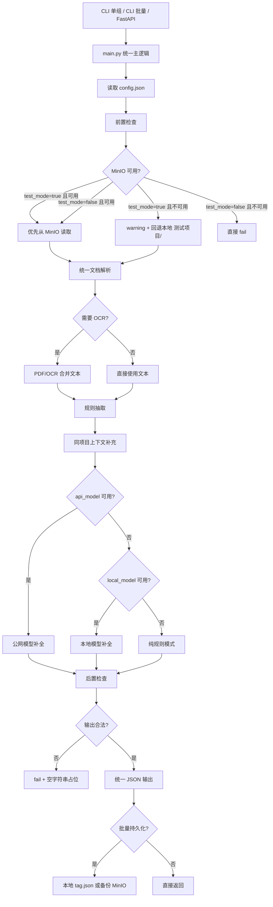

# 工程说明

## 1. 工程中各文件名及功能解释

- `main.py`：统一核心入口。负责配置加载、前置检查、MinIO 检查、文档读取、OCR 触发、规则抽取、模型降级、后置检查、批量持久化。
- `fastapi_app.py`：FastAPI 服务入口，只做 HTTP 请求校验与返回包装，核心处理直接复用 `main.process_request(...)`。
- `config.json`：运行配置。顶层固定为 `test_mode`、`minio`、`api_model`、`local_model`、`ocr`、`paths`、`logging`、`output`。
- `filejsonrst.json`：批量任务输入文件。
- `prompt.json`：本地提示词模板，仅在规则结果不完整或置信度偏低时用于模型补全。
- `test_report.md`：测试报告。
- `测试项目/`：本地测试数据目录。

## 2. 项目运行环境

### 系统环境

- 已实测：Windows 10 64bit，`Windows-10-10.0.19045-SP0`
- 兼容目标：Win10、Linux

### Python 版本

- 已实测：`Python 3.14.3`
- 建议：`Python 3.10+`

### Python 第三方依赖及版本

- `fastapi==0.135.2`
- `pydantic==2.12.5`
- `uvicorn==0.42.0`
- `minio==7.2.20`
- `python-docx==1.2.0`
- `docx2txt==0.9`
- `pypdf==5.9.0`
- `PyMuPDF==1.27.2.2`
- `openpyxl==3.1.5`
- `xlrd==2.0.2`
- `rapidocr-onnxruntime==1.2.3`
- `numpy==2.4.3`
- `pywin32==311`

### 其它第三方包及版本

- Windows `.doc` / 部分 Excel 回退链路依赖本机 Office COM 与 `pywin32`
- Linux `.doc` 回退链路优先使用 `antiword` / `catdoc`，再回退到 `soffice` 或 `libreoffice --headless`
- MinIO 连接使用 `config.json` 中的 SDK 端点配置，不在代码中硬编码

## 3. 项目运行逻辑



- 三种入口最终都走 `process_request(...)` 或 `process_manifest(...)`，没有三套分叉逻辑。
- 前置检查严格校验 4 个输入列表长度一致，且 `fileName`、`folderName` 必须字符串包含于对应 `fileFetchPath`。
- 文档路径统一按 `config.json -> paths.data_root` 拼接；`fileFetchPath` 相对的是业务根目录，不是代码目录。
- 支持 `pdf / doc / docx / xls / xlsx`。PDF 先抽文本，再按 `ocr.only_when_text_empty` 与 `ocr.min_chars_to_skip_ocr` 决定是否 OCR。
- `.doc` 读取链路支持 Win10 Office COM、Linux 外部工具回退，并补了纯二进制字符串探测兜底，避免无 Office 时整份文档不可用。
- 项目级抽取会把当前批次中的 `标签/封面/主报告` 权重调高，同时补充同项目根目录下的锚点文档，尽量避免章节页和附件页把主结论带偏。
- 单位抽取增加了简称/全称别名合并，尽量把“集团简称”“子公司全称”“封面法人名称”收敛到更完整的组织名称。
- 项目名抽取增加了基于 `zipName / folderName / fileName / fileFetchPath` 的路径共识打分，降低局部附件标题压过主项目名的概率。
- 模型降级顺序固定：`api_model -> local_model -> 无模型模式`。任一模型失败都记录 warning，不会因为断网而整体不可运行。
- 后置检查严格校验统一输出 schema；一旦长度不一致或状态非法，整批直接 `fail`。

## 4. 项目启动方式

### 单组数据启动

```powershell
python main.py --config .\config.json --payload-file .\single_payload.json
```

```powershell
python main.py --config .\config.json --payload-json "{\"zipName\":[\"...\"],\"folderName\":[\"...\"],\"fileName\":[\"...\"],\"fileFetchPath\":[\"...\"]}"
```

```powershell
Get-Content .\single_payload.json | python main.py --config .\config.json --stdin-json
```

- 单组入口也支持 `--test-mode true|false` 临时覆盖 `config.json` 中的测试模式，便于现场做 MinIO 分支烟测而不改正式配置

### 批量数据启动

```powershell
python main.py --config .\config.json --filejsonrst .\filejsonrst.json
```

- 批量模式读取 `filejsonrst.json`
- 批量入口同样支持 `--test-mode true|false` 临时覆盖配置中的测试模式
- `test_mode=true` 且 MinIO 不通时，warning 后回退本地 `测试项目/`
- `test_mode=false` 且 MinIO 不通时，整批直接 `fail`

### FastAPI 服务启动与逐条导入运行

```powershell
python -m uvicorn fastapi_app:app --host 0.0.0.0 --port 8000
```

- 健康检查：`GET /health`
- 执行接口：`POST /run`
- 请求体只能使用公开 schema，不接受额外字段
- 如果设置了环境变量 `API_TOKEN`，请求头需带 `X-API-Token`

请求体示例：

```json
{
  "zipName": ["426厂专船初设（V6.0）"],
  "folderName": ["426厂专船初设（V6.0）"],
  "fileName": ["1标签-1.docx"],
  "fileFetchPath": ["测试项目/426厂专船初设（V6.0）/1标签-1.docx"]
}
```

## 5. 用户交互

### 输入字段含义

- `zipName`：项目压缩包名或归档根目录名
- `folderName`：当前文件所在文件夹名
- `fileName`：当前文件名
- `fileFetchPath`：相对 `C:\Users\57780\Desktop\zch` 的相对路径

### 返回字段含义

- `unit`：所属单位
- `product`：成功时固定为 `N/A`；失败时为空字符串
- `project_type`：只允许 `固定资产投资 / 科研项目 / 规划 / 政策法规 / 其他`
- `project_name`：项目核心名称
- `project_stage`：只允许 `立项 / 可研 / 初设 / 竣工`
- `status`：整体状态，只允许 `success / fail`

成功返回示例：

```json
{
  "unit": ["大连船舶重工集团有限公司"],
  "product": ["N/A"],
  "project_type": ["固定资产投资"],
  "project_name": ["专船需求设施改造建设项目"],
  "project_stage": ["初设"],
  "status": "success"
}
```

失败返回示例：

```json
{
  "unit": [""],
  "product": [""],
  "project_type": [""],
  "project_name": [""],
  "project_stage": [""],
  "status": "fail"
}
```

## 6. 泛化性和鲁棒性分析

- 入口层完全统一，CLI 单组、CLI 批量、FastAPI 只是在输入/输出包装上不同。
- 所有敏感配置都来自 `config.json`，代码中没有硬编码 MinIO 地址、账号密码、模型地址、OCR 阈值。
- 在无公网、无本地模型时仍可运行，至少能落到纯规则模式完成抽取。
- OCR 触发、MinIO 分流、模型降级、失败占位、后置检查都落实在代码里，不依赖 README 说明。
- 本轮优化没有根据测试集反向改写 prompt；改动集中在通用规则层：上下文隔离、锚点文档优先、`.doc` 兜底读取、主批次文档分级加权。
- 当前仍存在的风险主要在历史扫描件、封面缺失、集团/子公司同页出现、以及专业分册仅含局部子项标题的场景；这些情况下 `unit` 和 `project_name` 仍可能需要人工复核。

## 7. 适用场景

- 工程档案、可研/初设/竣工资料的批量元信息抽取
- 需要同时提供命令行单次、命令行批量、FastAPI 三种接入方式的现场部署
- 内外网环境不稳定，但仍要求系统至少能以规则模式离线运行
- 客户现场已部署 OpenAI Compatible 本地模型，希望在规则基础上做补全，但不把模型作为唯一依赖
